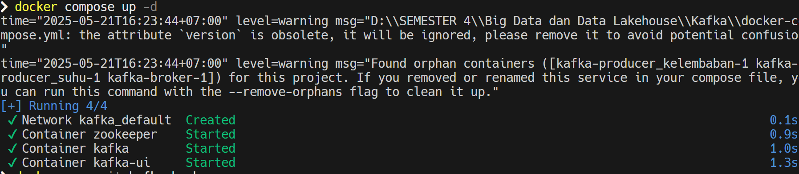
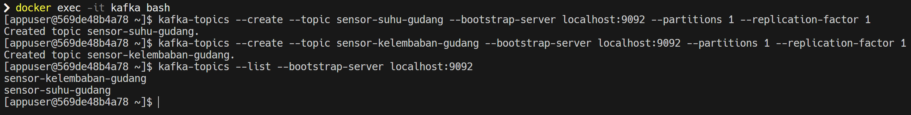
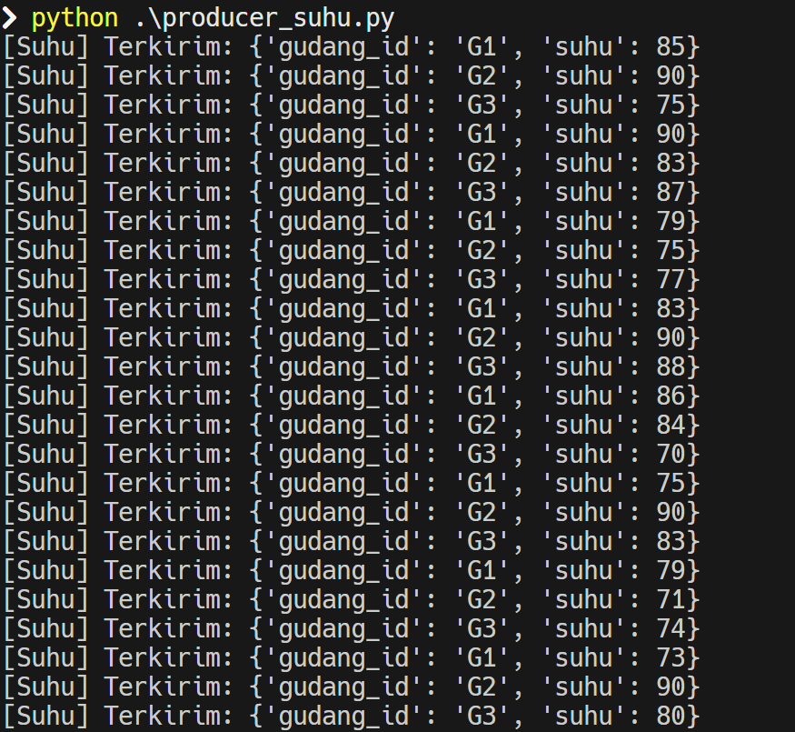
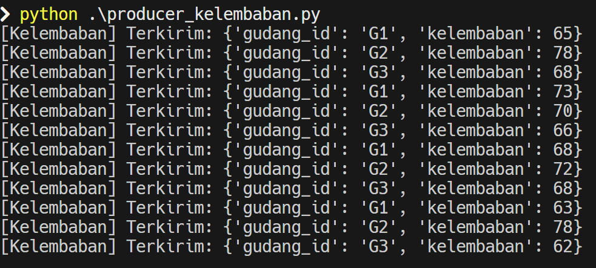
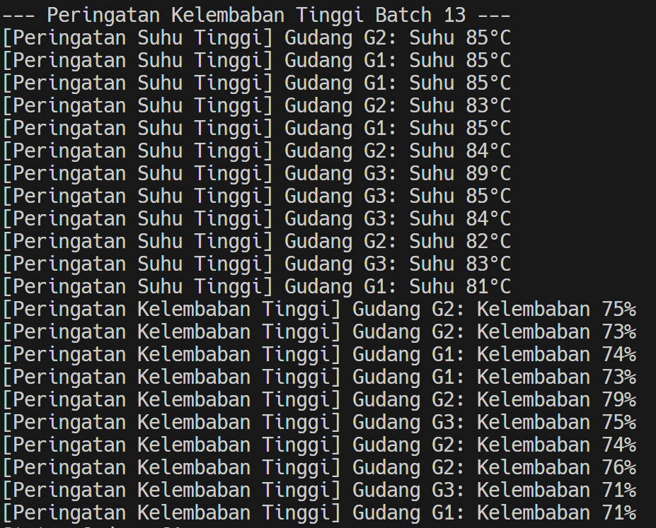

# Kafka and PySpark Warehouse Monitoring

This project demonstrates a real-time data processing pipeline using Kafka and PySpark. It simulates sensor data (temperature and humidity) from multiple warehouses, processes this data, and provides a status report for each warehouse.

## Problem Overview
Sebuah perusahaan logistik mengelola beberapa gudang penyimpanan yang menyimpan barang sensitif seperti makanan, obat-obatan, dan elektronik. Untuk menjaga kualitas penyimpanan, gudang-gudang tersebut dilengkapi dengan dua jenis sensor:

- Sensor Suhu

- Sensor Kelembaban

Sensor akan mengirimkan data setiap detik. Perusahaan ingin memantau kondisi gudang secara real-time untuk mencegah kerusakan barang akibat suhu terlalu tinggi atau kelembaban berlebih.

## Arsitektur & Alur Data

**`producer_suhu.py` & `producer_kelembaban.py`:**

* Berfungsi sebagai penghasil data sensor suhu dan kelembapan.
* Data disusun dalam format JSON.
* Data dikirimkan melalui Kafka ke dua topik yang berbeda: `sensor-suhu-gudang` dan `sensor-kelembaban-gudang`.

**Kafka:**

* Berperan sebagai sistem perantara pesan yang menerima data dari produsen.
* Mengelola aliran data dengan memisahkannya ke dalam topik khusus untuk suhu dan kelembapan.

**`pyspark_consumer.py` (PySpark):**

* Merupakan aplikasi PySpark yang menjadi konsumen data dari topik Kafka `sensor-suhu-gudang` dan `sensor-kelembaban-gudang`.

* **Pemrosesan Data Suhu:**

  * Mengambil data dari topik `sensor-suhu-gudang`.
  * Mengekstrak informasi seperti suhu, ID gudang, dan stempel waktu dari data JSON.
  * Menambahkan *watermark* untuk menangani data yang terlambat.
  * Menerapkan teknik *windowing* (misalnya, tumbling window) untuk mengelompokkan data dalam periode waktu tertentu.

* **Pemrosesan Data Kelembapan:**

  * Mengambil data dari topik `sensor-kelembaban-gudang`.
  * Mengekstrak nilai kelembapan dan informasi tambahan dari JSON.
  * Menambahkan *watermark* untuk mengantisipasi keterlambatan data.
  * Menerapkan windowing dengan periode waktu yang serupa dengan pemrosesan suhu.

* **Penggabungan `full_outer`:**

  * Menggabungkan hasil pemrosesan suhu dan kelembapan berdasarkan ID gudang dan jendela waktu.
  * Menggunakan gabungan `full_outer` agar data tetap digabung meskipun hanya satu jenis sensor yang mengirim data dalam jangka waktu tertentu.

* **Penentuan Status:**

  * Setelah penggabungan, logika bisnis digunakan untuk menentukan status kondisi gudang.
  * Penilaian status didasarkan pada apakah suhu dan kelembapan berada dalam kisaran ideal, terlalu tinggi, atau terlalu rendah.

* **Output ke Konsol:**

  * Informasi hasil akhir berupa ID gudang, waktu jendela, nilai suhu dan kelembapan, serta statusnya akan ditampilkan ke konsol secara berkala (setiap 5 detik).


## Fungsi Utama
### 1. `docker-compose.yml`
File ini mendefinisikan dan mengkonfigurasi layanan yang dibutuhkan untuk menjalankan aplikasi:

- `zookeeper`: Menggunakan image `confluentinc/cp-zookeeper:7.4.0`. Zookeeper bertanggung jawab untuk manajemen konfigurasi dan sinkronisasi dalam cluster Kafka.

- kafka: Menggunakan image `confluentinc/cp-kafka:7.4.0`. Ini adalah broker pesan utama yang menerima, menyimpan, dan mengirimkan aliran data sensor. Konfigurasi `KAFKA_ADVERTISED_LISTENERS` memungkinkan koneksi ke Kafka baik dari dalam jaringan Docker (kafka:9092) maupun dari host (localhost:29092). Topik akan dibuat secara otomatis (`KAFKA_AUTO_CREATE_TOPICS_ENABLE: "true"`).

- kafka-ui: Menggunakan image `provectuslabs/kafka-ui:latest`. Menyediakan antarmuka pengguna berbasis web untuk memantau dan mengelola cluster Kafka, yang dapat diakses di `http://localhost:8080`.

### 2. `producer_suhu.py`
Skrip Python ini bertindak sebagai producer untuk data suhu:

- Terhubung ke Kafka pada `localhost:29092`.
- Secara periodik (setiap detik), menghasilkan data suhu acak (antara 70 dan 90) untuk tiga gudang (`G1`, `G2`, `G3`).
- Mengirimkan data ini dalam format JSON ke topik Kafka `sensor-suhu-gudang`.
- Mencetak pesan konfirmasi ke konsol setiap kali data dikirim.
```python
from kafka import KafkaProducer
import json
import time
import random

producer = KafkaProducer(
    bootstrap_servers='localhost:29092',
    value_serializer=lambda v: json.dumps(v).encode('utf-8')
)

gudang_id = ['G1', 'G2', 'G3']


def kirim_suhu():
    while True:
        for gid in gudang_id:
            suhu = random.randint(70, 90)
            data = {"gudang_id": gid, "suhu": suhu}
            producer.send('sensor-suhu-gudang', value=data)
            print(f"[Suhu] Terkirim: {data}")
        time.sleep(1)


if __name__ == "__main__":
    kirim_suhu()

```

### 3. `producer_kelembaban.py`
Skrip Python ini bertindak sebagai producer untuk data kelembaban:

- Terhubung ke Kafka pada `localhost:29092`.
- Secara periodik (setiap detik), menghasilkan data kelembaban acak (antara 60 dan 80) untuk tiga gudang (`G1`, `G2`, `G3`).
- Mengirimkan data ini dalam format JSON ke topik Kafka `sensor-kelembaban-gudang`.
- Mencetak pesan konfirmasi ke konsol setiap kali data dikirim.
```python
from kafka import KafkaProducer
import json
import time
import random

producer = KafkaProducer(
    bootstrap_servers='localhost:29092',
    value_serializer=lambda v: json.dumps(v).encode('utf-8')
)

gudang_id = ['G1', 'G2', 'G3']

def kirim_kelembaban():
    while True:
        for gid in gudang_id:
            kelembaban = random.randint(60, 80)
            data = {"gudang_id": gid, "kelembaban": kelembaban}
            producer.send('sensor-kelembaban-gudang', value=data)
            print(f"[Kelembaban] Terkirim: {data}")
        time.sleep(1)

if __name__ == "__main__":
    kirim_kelembaban()
```
4. `pyspark_consumer.py`
Aplikasi PySpark ini berfungsi sebagai consumer dan pemroses data:

- Membuat SparkSession dengan konfigurasi untuk terhubung ke Kafka.
- Mendefinisikan skema untuk data suhu (schema_suhu) dan kelembaban (schema_kelembaban).
- **Membaca Stream Suhu**:
    - Terhubung ke topik sensor-suhu-gudang di Kafka (localhost:29092).
    - Mengurai data JSON, menambahkan timestamp, dan menerapkan watermark (15 detik) untuk menangani data yang  terlambat.
    - Mengelompokkan data suhu ke dalam window waktu 10 detik.
- **Membaca Stream Kelembaban**:
    - Terhubung ke topik sensor-kelembaban-gudang di Kafka (localhost:29092).
    - Melakukan proses serupa seperti pada stream suhu (parsing, timestamp, watermark, windowing).
- **Menggabungkan Stream**:
    - Melakukan full_outer join pada stream suhu dan kelembaban berdasarkan gudang_id dan window. Ini memastikan semua data dari kedua sensor dipertimbangkan, bahkan jika salah satu sensor tidak mengirim data pada interval tertentu.
- **Menentukan Status**:
    - Menggunakan fungsi coalesce untuk menangani nilai NULL (jika salah satu sensor tidak mengirim data) dengan menggantinya menjadi 0.
    - Menerapkan logika kondisional (when) untuk menentukan status gudang (Aman, Suhu tinggi, kelembaban normal, Kelembaban tinggi, suhu aman, Bahaya tinggi! Barang berisiko rusak) berdasarkan nilai suhu dan kelembaban.
- **Output**:
    - Menulis hasil (Gudang, Suhu, Kelembaban, Status, window) ke konsol setiap 5 detik dalam mode append.
```python
from pyspark.sql import SparkSession
from pyspark.sql.functions import (
    from_json, col, expr, window, when, lit, coalesce
)
from pyspark.sql.types import StructType, StringType, IntegerType

spark = SparkSession.builder \
    .appName("MonitoringGudang") \
    .config(
        "spark.jars.packages",
        "org.apache.spark:spark-sql-kafka-0-10_2.12:3.5.5"
    ) \
    .getOrCreate()

spark.sparkContext.setLogLevel("ERROR")

schema_suhu = StructType().add("gudang_id", StringType()).add("suhu", IntegerType())
schema_kelembaban = StructType().add("gudang_id", StringType()
                                     ).add("kelembaban", IntegerType())

suhu_df = (
    spark.readStream
         .format("kafka")
         .option("kafka.bootstrap.servers", "localhost:29092")
         .option("subscribe", "sensor-suhu-gudang")
         .load()
)

suhu_stream = (
    suhu_df
    .selectExpr("CAST(value AS STRING) AS json")
    .select(from_json("json", schema_suhu).alias("d"))
    .select("d.gudang_id", "d.suhu", expr("current_timestamp() AS ts"))
    .withWatermark("ts", "15 seconds")
    .select("gudang_id", "suhu", window("ts", "10 seconds").alias("window"))
)

kelembaban_df = (
    spark.readStream
         .format("kafka")
         .option("kafka.bootstrap.servers", "localhost:29092")
         .option("subscribe", "sensor-kelembaban-gudang")
         .load()
)

kelembaban_stream = (
    kelembaban_df
    .selectExpr("CAST(value AS STRING) AS json")
    .select(from_json("json", schema_kelembaban).alias("d"))
    .select("d.gudang_id", "d.kelembaban", expr("current_timestamp() AS ts"))
    .withWatermark("ts", "15 seconds")
    .select("gudang_id", "kelembaban", window("ts", "10 seconds").alias("window"))
)

report_stream = suhu_stream.join(
    kelembaban_stream,
    on=["gudang_id", "window"],
    how="full_outer"
)

kombinasi suhu & kelembaban
status_stream = report_stream.select(
    col("gudang_id").alias("Gudang"),
    coalesce(col("suhu"), lit(0)).alias("Suhu"),
    coalesce(col("kelembaban"), lit(0)).alias("Kelembaban"),
    when(
        (col("Suhu") > 80) & (col("Kelembaban") > 70),
        lit("Bahaya tinggi! Barang berisiko rusak")
    ).when(
        (col("Suhu") > 80) & (col("Kelembaban") <= 70),
        lit("Suhu tinggi, kelembaban normal")
    ).when(
        (col("Suhu") <= 80) & (col("Kelembaban") > 70),
        lit("Kelembaban tinggi, suhu aman")
    ).otherwise(
        lit("Aman")
    ).alias("Status"),
    "window"
)

query = status_stream.writeStream \
    .outputMode("append") \
    .format("console") \
    .option("truncate", False) \
    .trigger(processingTime="5 seconds") \
    .start()

query.awaitTermination()
```

## How to Run
1. Start Kafka Services
```sh
docker-compose up -d
```


2. Enter Kafka terminal to make topics
```bash
kafka-topics --create --topic sensor-suhu-gudang --bootstrap-server localhost:9092 --partitions 1 --replication-factor 1
kafka-topics --create --topic sensor-kelembaban-gudang --bootstrap-server localhost:9092 --partitions 1 --replication-factor 1
```
Then make sure that it's running
```bash
kafka-topics --list --bootstrap-server localhost:9092
```


3. Run the Kafka Producers
```sh
python producer_suhu.py
```
```sh
python producer_kelembaban.py
```



4. Run Spark Consumer
```sh
python pyspark_consumer.py
```
