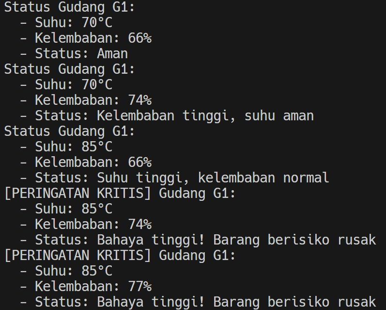

# Kafka and PySpark Warehouse Monitoring

This project demonstrates a real-time data processing pipeline using Kafka and PySpark. It simulates sensor data (temperature and humidity) from multiple warehouses, processes this data, and provides a status report for each warehouse.

## Problem Overview

Sebuah perusahaan logistik mengelola beberapa gudang penyimpanan yang menyimpan barang sensitif seperti makanan, obat-obatan, dan elektronik. Untuk menjaga kualitas penyimpanan, gudang-gudang tersebut dilengkapi dengan dua jenis sensor:

- Sensor Suhu

- Sensor Kelembaban

Sensor akan mengirimkan data setiap detik. Perusahaan ingin memantau kondisi gudang secara real-time untuk mencegah kerusakan barang akibat suhu terlalu tinggi atau kelembaban berlebih.

## Arsitektur & Alur Data

**`producer_suhu.py` & `producer_kelembaban.py`:**

- Berfungsi sebagai penghasil data sensor suhu dan kelembapan.
- Data disusun dalam format JSON.
- Data dikirimkan melalui Kafka ke dua topik yang berbeda: `sensor-suhu-gudang` dan `sensor-kelembaban-gudang`.

**Kafka:**

- Berperan sebagai sistem perantara pesan yang menerima data dari produsen.
- Mengelola aliran data dengan memisahkannya ke dalam topik khusus untuk suhu dan kelembapan.

**`pyspark_consumer.py` (PySpark):**

- Merupakan aplikasi PySpark yang menjadi konsumen data dari topik Kafka `sensor-suhu-gudang` dan `sensor-kelembaban-gudang`.

- **Pemrosesan Data Suhu:**

  - Mengambil data dari topik `sensor-suhu-gudang`.
  - Mengekstrak informasi seperti suhu, ID gudang, dan stempel waktu dari data JSON.
  - Menambahkan _watermark_ untuk menangani data yang terlambat.
  - Menerapkan teknik _windowing_ (misalnya, tumbling window) untuk mengelompokkan data dalam periode waktu tertentu.

- **Pemrosesan Data Kelembapan:**

  - Mengambil data dari topik `sensor-kelembaban-gudang`.
  - Mengekstrak nilai kelembapan dan informasi tambahan dari JSON.
  - Menambahkan _watermark_ untuk mengantisipasi keterlambatan data.
  - Menerapkan windowing dengan periode waktu yang serupa dengan pemrosesan suhu.

- **Penggabungan `full_outer`:**

  - Menggabungkan hasil pemrosesan suhu dan kelembapan berdasarkan ID gudang dan jendela waktu.
  - Menggunakan gabungan `full_outer` agar data tetap digabung meskipun hanya satu jenis sensor yang mengirim data dalam jangka waktu tertentu.

- **Penentuan Status:**

  - Setelah penggabungan, logika bisnis digunakan untuk menentukan status kondisi gudang.
  - Penilaian status didasarkan pada apakah suhu dan kelembapan berada dalam kisaran ideal, terlalu tinggi, atau terlalu rendah.

- **Output ke Konsol:**

  - Informasi hasil akhir berupa ID gudang, waktu jendela, nilai suhu dan kelembapan, serta statusnya akan ditampilkan ke konsol secara berkala (setiap 5 detik).

## Fungsi Utama

### 1. `docker-compose.yml`

File ini mendefinisikan dan mengkonfigurasi layanan yang dibutuhkan untuk menjalankan aplikasi:

- `zookeeper`: Menggunakan image `confluentinc/cp-zookeeper:7.4.0`. Zookeeper bertanggung jawab untuk manajemen konfigurasi dan sinkronisasi dalam cluster Kafka.

- kafka: Menggunakan image `confluentinc/cp-kafka:7.4.0`. Ini adalah broker pesan utama yang menerima, menyimpan, dan mengirimkan aliran data sensor. Konfigurasi `KAFKA_ADVERTISED_LISTENERS` memungkinkan koneksi ke Kafka baik dari dalam jaringan Docker (kafka:9092) maupun dari host (localhost:29092). Topik akan dibuat secara otomatis (`KAFKA_AUTO_CREATE_TOPICS_ENABLE: "true"`).

- kafka-ui: Menggunakan image `provectuslabs/kafka-ui:latest`. Menyediakan antarmuka pengguna berbasis web untuk memantau dan mengelola cluster Kafka, yang dapat diakses di `http://localhost:8080`.

### 2. `producer_suhu.py`

Skrip Python ini bertindak sebagai producer untuk data suhu:

- Terhubung ke Kafka pada `localhost:29092`.
- Secara periodik (setiap detik), menghasilkan data suhu acak (antara 70 dan 90) untuk tiga gudang (`G1`, `G2`, `G3`).
- Mengirimkan data ini dalam format JSON ke topik Kafka `sensor-suhu-gudang`.
- Mencetak pesan konfirmasi ke konsol setiap kali data dikirim.

```python
import json
import time
import random
from kafka import KafkaProducer

KAFKA_TOPIC_NAME = "sensor-suhu-gudang"
KAFKA_BOOTSTRAP_SERVERS = 'localhost:29092'

GUDANG_IDS = ["G1", "G2", "G3"]

if __name__ == "__main__":
    print("Memulai Kafka Producer Suhu...")
    producer = KafkaProducer(
        bootstrap_servers=KAFKA_BOOTSTRAP_SERVERS,
        value_serializer=lambda v: json.dumps(v).encode('utf-8')
    )

    try:
        while True:
            gudang_id = random.choice(GUDANG_IDS)
            # Simulasikan suhu (misal antara 70 dan 90, dengan occasional spikes)
            suhu = random.randint(70, 85)
            if random.random() < 0.1:  # 10% chance of higher temp
                suhu = random.randint(81, 90)

            message = {
                "gudang_id": gudang_id,
                "suhu": suhu,
                "timestamp": time.time()
            }
            print(f"Mengirim data suhu: {message}")
            producer.send(KAFKA_TOPIC_NAME, message)
            producer.flush()
            time.sleep(1)
    except KeyboardInterrupt:
        print("Producer Suhu dihentikan.")
    finally:
        producer.close()
        print("Koneksi Producer Suhu ditutup.")
```

### 3. `producer_kelembaban.py`

Skrip Python ini bertindak sebagai producer untuk data kelembaban:

- Terhubung ke Kafka pada `localhost:29092`.
- Secara periodik (setiap detik), menghasilkan data kelembaban acak (antara 60 dan 80) untuk tiga gudang (`G1`, `G2`, `G3`).
- Mengirimkan data ini dalam format JSON ke topik Kafka `sensor-kelembaban-gudang`.
- Mencetak pesan konfirmasi ke konsol setiap kali data dikirim.

```python
import json
import time
import random
from kafka import KafkaProducer

KAFKA_TOPIC_NAME = "sensor-kelembaban-gudang"
KAFKA_BOOTSTRAP_SERVERS = 'localhost:29092'

GUDANG_IDS = ["G1", "G2", "G3"]

if __name__ == "__main__":
    print("Memulai Kafka Producer Kelembaban...")
    producer = KafkaProducer(
        bootstrap_servers=KAFKA_BOOTSTRAP_SERVERS,
        value_serializer=lambda v: json.dumps(v).encode('utf-8')
    )

    try:
        while True:
            gudang_id = random.choice(GUDANG_IDS)
            # Simulasikan kelembaban (misal antara 60 dan 80, dengan occasional spikes)
            kelembaban = random.randint(60, 75)
            if random.random() < 0.1:  # 10% chance of higher humidity
                kelembaban = random.randint(71, 85)

            message = {
                "gudang_id": gudang_id,
                "kelembaban": kelembaban,
                "timestamp": time.time()
            }
            print(f"Mengirim data kelembaban: {message}")
            producer.send(KAFKA_TOPIC_NAME, message)
            producer.flush()
            time.sleep(1)
    except KeyboardInterrupt:
        print("Producer Kelembaban dihentikan.")
    finally:
        producer.close()
        print("Koneksi Producer Kelembaban ditutup.")
```

4. `pyspark_consumer.py`
   Aplikasi PySpark ini berfungsi sebagai consumer dan pemroses data:

- Membuat SparkSession dengan konfigurasi untuk terhubung ke Kafka.
- Mendefinisikan skema untuk data suhu (schema_suhu) dan kelembaban (schema_kelembaban).
- **Membaca Stream Suhu**:
  - Terhubung ke topik sensor-suhu-gudang di Kafka (localhost:29092).
  - Mengurai data JSON, menambahkan timestamp, dan menerapkan watermark (15 detik) untuk menangani data yang terlambat.
  - Mengelompokkan data suhu ke dalam window waktu 10 detik.
- **Membaca Stream Kelembaban**:
  - Terhubung ke topik sensor-kelembaban-gudang di Kafka (localhost:29092).
  - Melakukan proses serupa seperti pada stream suhu (parsing, timestamp, watermark, windowing).
- **Menggabungkan Stream**:
  - Melakukan full_outer join pada stream suhu dan kelembaban berdasarkan gudang_id dan window. Ini memastikan semua data dari kedua sensor dipertimbangkan, bahkan jika salah satu sensor tidak mengirim data pada interval tertentu.
- **Menentukan Status**:
  - Menggunakan fungsi coalesce untuk menangani nilai NULL (jika salah satu sensor tidak mengirim data) dengan menggantinya menjadi 0.
  - Menerapkan logika kondisional (when) untuk menentukan status gudang (Aman, Suhu tinggi, kelembaban normal, Kelembaban tinggi, suhu aman, Bahaya tinggi! Barang berisiko rusak) berdasarkan nilai suhu dan kelembaban.
- **Output**:
  - Menulis hasil (Gudang, Suhu, Kelembaban, Status, window) ke konsol setiap 5 detik dalam mode append.

```python
from pyspark.sql import SparkSession
from pyspark.sql.functions import from_json, col, expr, when, concat, lit
from pyspark.sql.types import StructType, StructField, StringType, IntegerType, DoubleType, TimestampType

KAFKA_BOOTSTRAP_SERVERS = 'localhost:29092'
SUHU_TOPIC = "sensor-suhu-gudang"
KELEMBABAN_TOPIC = "sensor-kelembaban-gudang"

# Skema untuk data suhu
suhu_schema = StructType([
    StructField("gudang_id", StringType(), True),
    StructField("suhu", IntegerType(), True),
    StructField("timestamp", DoubleType(), True)
])

# Skema untuk data kelembaban
kelembaban_schema = StructType([
    StructField("gudang_id", StringType(), True),
    StructField("kelembaban", IntegerType(), True),
    StructField("timestamp", DoubleType(), True)
])

if __name__ == "__main__":
    spark = SparkSession.builder \
        .appName("WarehouseMonitor") \
        .config("spark.jars.packages", "org.apache.spark:spark-sql-kafka-0-10_2.12:3.5.0") \
        .config("spark.sql.streaming.forceDeleteTempCheckpointLocation", "true") \
        .getOrCreate()
    spark.sparkContext.setLogLevel("ERROR")

    # Tangkap stream dari Kafka
    df_suhu_raw = spark.readStream \
        .format("kafka") \
        .option("kafka.bootstrap.servers", KAFKA_BOOTSTRAP_SERVERS) \
        .option("subscribe", SUHU_TOPIC) \
        .option("startingOffsets", "latest") \
        .load()

    df_kelembaban_raw = spark.readStream \
        .format("kafka") \
        .option("kafka.bootstrap.servers", KAFKA_BOOTSTRAP_SERVERS) \
        .option("subscribe", KELEMBABAN_TOPIC) \
        .option("startingOffsets", "latest") \
        .load()

    # Parse JSON dari value Kafka dan tambahkan timestamp event
    df_suhu = df_suhu_raw.selectExpr("CAST(value AS STRING) as json_string") \
        .select(from_json(col("json_string"), suhu_schema).alias("data")) \
        .select("data.*") \
        .withColumn("event_time_suhu", (col("timestamp")).cast(TimestampType())) \
        .withColumnRenamed("gudang_id", "gudang_id_suhu") \
        .withColumnRenamed("suhu", "nilai_suhu")

    df_kelembaban = df_kelembaban_raw.selectExpr("CAST(value AS STRING) as json_string") \
        .select(from_json(col("json_string"), kelembaban_schema).alias("data")) \
        .select("data.*") \
        .withColumn("event_time_kelembaban", (col("timestamp")).cast(TimestampType())) \
        .withColumnRenamed("gudang_id", "gudang_id_kelembaban") \
        .withColumnRenamed("kelembaban", "nilai_kelembaban")

    # Peringatan Suhu Tinggi
    def process_suhu_alert_batch(batch_df, epoch_id):
        if batch_df.count() > 0:
            print(f"\n--- Peringatan Suhu Tinggi Batch {epoch_id} ---")
            for row in batch_df.collect():
                print(
                    f"[Peringatan Suhu Tinggi] Gudang {row.gudang_id_suhu}: Suhu {row.nilai_suhu}°C")

    query_suhu_alert = df_suhu \
        .filter(col("nilai_suhu") > 80) \
        .writeStream \
        .outputMode("append") \
        .foreachBatch(process_suhu_alert_batch) \
        .start()

    # Peringatan Kelembaban Tinggi
    def process_kelembaban_alert_batch(batch_df, epoch_id):
        if batch_df.count() > 0:
            print(f"\n--- Peringatan Kelembaban Tinggi Batch {epoch_id} ---")
            for row in batch_df.collect():
                print(
                    f"[Peringatan Kelembaban Tinggi] Gudang {row.gudang_id_kelembaban}: Kelembaban {row.nilai_kelembaban}%")

    query_kelembaban_alert = df_kelembaban \
        .filter(col("nilai_kelembaban") > 70) \
        .writeStream \
        .outputMode("append") \
        .foreachBatch(process_kelembaban_alert_batch) \
        .start()

    # Watermarking stream suhu dan kelembaban
    df_suhu_watermarked = df_suhu.withWatermark(
        "event_time_suhu", "10 seconds")
    df_kelembaban_watermarked = df_kelembaban.withWatermark(
        "event_time_kelembaban", "10 seconds")

    # Join stream suhu dan kelembaban berdasarkan gudang_id
    joined_df = df_suhu_watermarked.join(
        df_kelembaban_watermarked,
        expr("""
            gudang_id_suhu = gudang_id_kelembaban AND
            event_time_suhu >= event_time_kelembaban - interval 5 seconds AND
            event_time_suhu <= event_time_kelembaban + interval 5 seconds
        """),
        "inner"
    )

    # Status report untuk setiap gudang
    status_df = joined_df.select(
        col("gudang_id_suhu").alias("gudang_id"),
        col("nilai_suhu"),
        col("nilai_kelembaban"),
        col("event_time_suhu").alias("event_time")
    ).withColumn("status",
                 when((col("nilai_suhu") > 80) & (col("nilai_kelembaban")
                      > 70), "Bahaya tinggi! Barang berisiko rusak")
                 .when(col("nilai_suhu") > 80, "Suhu tinggi, kelembaban normal")
                 .when(col("nilai_kelembaban") > 70, "Kelembaban tinggi, suhu aman")
                 .otherwise("Aman")
                 )

    # Fungsi untuk memformat output gabungan per batch
    def process_combined_batch(batch_df, epoch_id):
        if batch_df.count() == 0:
            return

        print(f"\n--- Laporan Gabungan Batch {epoch_id} ---")
        collected_rows = batch_df.orderBy("gudang_id", "event_time").collect()

        for row in collected_rows:
            if row.status == "Bahaya tinggi! Barang berisiko rusak":
                print("[PERINGATAN KRITIS] Gudang {}:".format(row.gudang_id))
            else:
                print("Status Gudang {}:".format(row.gudang_id))
            print("  - Suhu: {}°C".format(row.nilai_suhu))
            print("  - Kelembaban: {}%".format(row.nilai_kelembaban))
            print("  - Status: {}".format(row.status))
        print("--- Akhir Laporan Gabungan Batch ---")

    # Output gabungan ke console menggunakan foreachBatch
    query_combined_status = status_df.writeStream.outputMode("append") \
        .foreachBatch(process_combined_batch) \
        .trigger(processingTime="10 seconds") \
        .start()

    # Tunggu semua stream query selesai
    spark.streams.awaitAnyTermination()
```

## How to Run

1. Start Kafka Services

```sh
docker-compose up -d
```


2. Enter Kafka terminal to make topics

```bash
kafka-topics --create --topic sensor-suhu-gudang --bootstrap-server localhost:9092 --partitions 1 --replication-factor 1
kafka-topics --create --topic sensor-kelembaban-gudang --bootstrap-server localhost:9092 --partitions 1 --replication-factor 1
```

Then make sure that it's running

```bash
kafka-topics --list --bootstrap-server localhost:9092
```


3. Run the Kafka Producers

```sh
python producer_suhu.py
```

```sh
python producer_kelembaban.py
```


4. Run Spark Consumer

```sh
python pyspark_consumer.py
```



